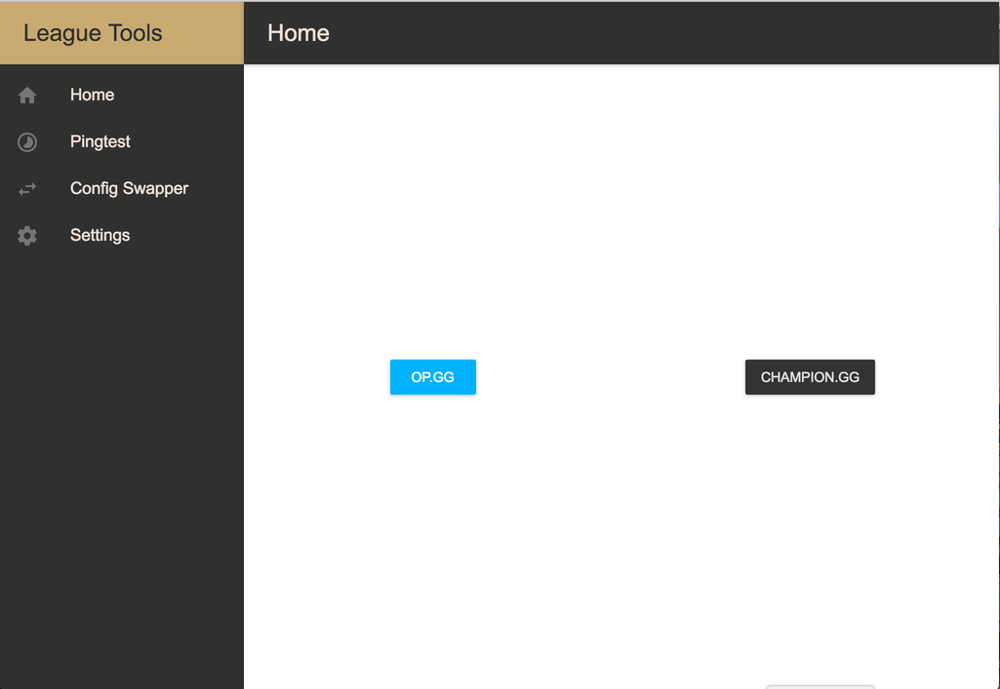
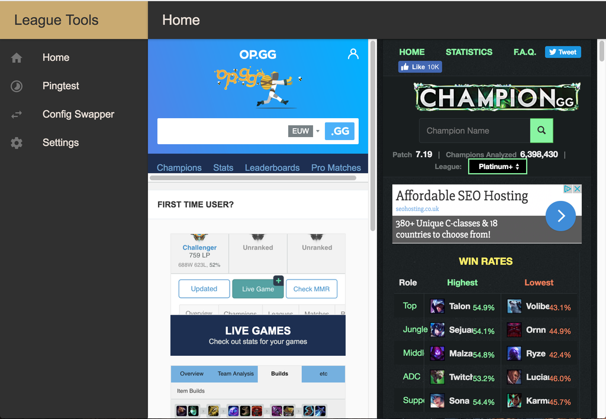
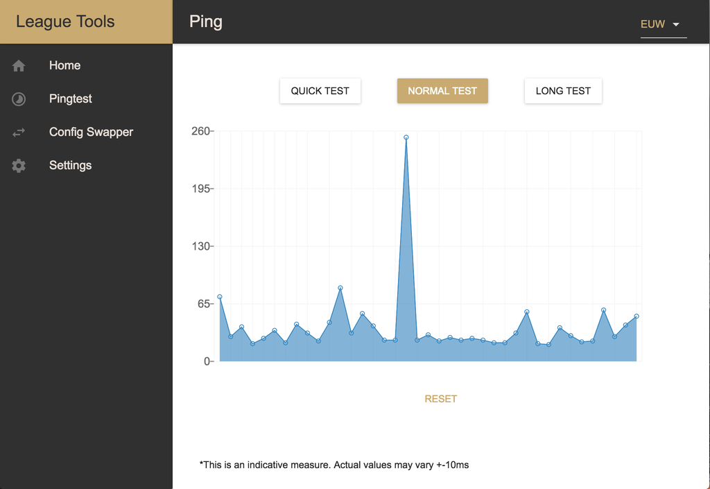
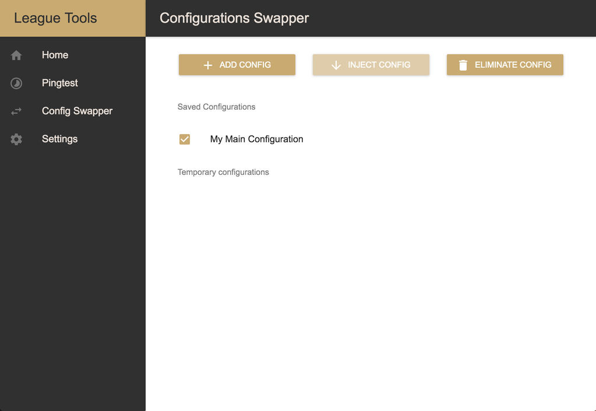
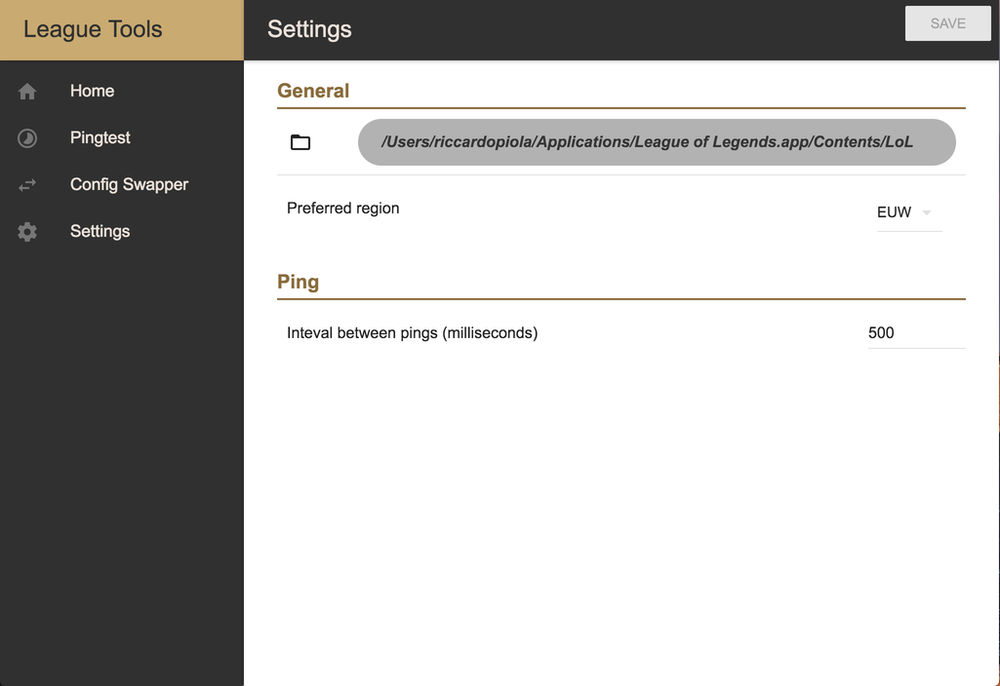

# League Tools
This is a simple app that includes some useful tools for League of Legends players

It's a proof of concept basically, I'm just experiment to see what I can come up with

A new and improved version is in development

## DOWNLOADS v0.2.0-alpha
- [Download Windows x64](https://github.com/riccardopiola/tools-for-league/releases/download/v0.2.0/Tools.for.LoL.Setup.0.2.0.exe)
- [Download MacOS](https://github.com/riccardopiola/tools-for-league/releases/download/v0.2.0/Tools.for.LoL-0.2.0.dmg)

## IMPORTANT
**ADD them to your antivirus exeptions**

The antivirus will probably tell you it has found a potentially dangerous application, that is because I did not sign those applications and the antivirus has never seen them before so it assumes that they could be dangerous.

The app has not bee thorougly tested it is probably full of bugs

### Improvements in this version
- Completely rewrote the ping function, now it works realiably both on windows and Mac (windows user may be required to give administrator permissions)
- Added Two simple webpages at the Home screen (not very useful for now)
- Completed the configswapper section
- Now you can edit the settings and tweak some functions
- Perfromance imporvements throughout the app

## Index of contents
- [Home](https://github.com/riccardopiola/tools-for-league#Home)
- [Ping](https://github.com/riccardopiola/tools-for-league#Ping)
- [Configurations Swapper](https://github.com/riccardopiola/tools-for-league#ConfigurationsSwapper)
- [Settings](https://github.com/riccardopiola/tools-for-league#Settings)

# Sections
## Home
The Home section is just a filler for now

## Ping
Ping the Riot Games servers to see if your connection is good enough to play a game

## ConfigurationsSwapper
Save your 'PersistedSettings.json' file (The file where you game settings are saved)

This settings file is bound to an account so if you from the same pc change account the game will load from the cloud a new PersistedSettings.json file associated with that account

With this tool you can have one file and automatically copy it whenever you need to change account

Use:
1. Log into your Main account (if your last game was with another account you have to start a custom to download the right settings file)
2. Save the file (See image)
3. Log onto another account (maybe your smurf?)
4. Start a custom to load the settings assocaited with that account
5. Inject the configuration you saved from your Main account
6. Go play a game with your settings :)

## Settings
change the settings as you prefer them or as you have to
#### General
- Folder icon
This is your League of Legends installation folder, it has to be set right for ConfigSwapper to work, to change simply click the folder icon, it will tell you if the folder you selected is right or not.

NOTE: It is set by default on the most common League of Legends installation folder so you likely don't have to change anything
- Preferred Region
This affects the Ping functionality, you can change against wich server to ping in the section itself but it will go back to the default if you dont change and save it in the Settings
#### Ping
- Interval between pings (milliseconds)
This sets how much time it passes between the pings you make

If set to 1000 it will do a ping every second (1000ms/ping)
If set to 500 it will do two pings every second (500ms/ping)

My suggested value is 500, if you get weird result though try with 1000 or even more

Obviously, the lower the 'interval between pings' is the more accurate the resulting graph is going to be

**remember to save your settings after you changed them**

